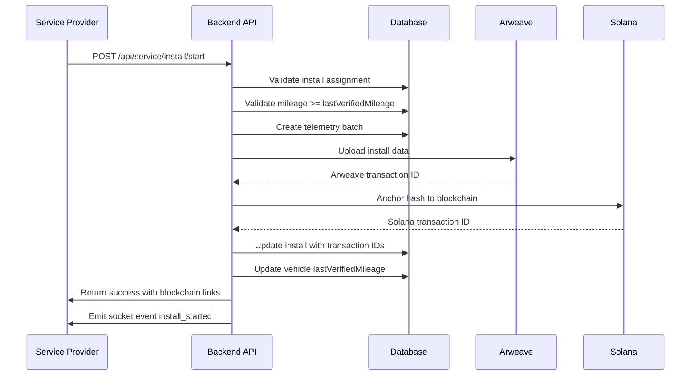

# BlockX Service Provider Install Lifecycle Implementation Summary

## Overview

This document summarizes the implementation of the Service Provider install lifecycle and anchoring flow for BlockX. The implementation ensures that all device installations are properly tracked, validated, and anchored to both Arweave and Solana blockchains for immutable verification.

## Files Created

### Backend

1. **Models**
   - `backend/src/models/TelemetryBatch.model.ts` - New model for telemetry batch data

2. **Controllers**
   - `backend/src/controllers/install.controller.ts` - Controller for install lifecycle operations

3. **Routes**
   - `backend/src/routes/serviceInstalls.routes.ts` - Routes for service provider install operations

4. **Services**
   - `backend/src/services/anchor.service.ts` - Service for anchoring to Arweave and Solana

5. **Utilities**
   - `backend/src/utils/socketEmitter.ts` - Utility for socket event emission

6. **Scripts**
   - `backend/src/scripts/migrate-add-install-model.js` - Migration script for database updates

7. **Tests**
   - `backend/src/tests/install.start.test.ts` - Tests for install start functionality
   - `backend/src/tests/install.assign.test.ts` - Tests for install assignment functionality

8. **Documentation**
   - `backend/docs/install-flow.md` - Detailed documentation of the install flow

### Frontend

1. **Components**
   - `frontend/src/components/SP/InstallStartModal.tsx` - Modal for starting installations

2. **Services**
   - `frontend/src/services/serviceInstalls.ts` - API client for service install operations

## Files Modified

### Backend

1. **Models**
   - `backend/src/models/core/Vehicle.model.ts` - Added `lastVerifiedMileage` field
   - `backend/src/models/Install.model.ts` - Added fields for anchoring and status tracking

2. **Server**
   - `backend/src/server.ts` - Added socket.io initialization

3. **Routes**
   - `backend/src/routes/index.ts` - Registered new service installs routes

### Frontend

1. **Pages**
   - `frontend/src/pages/SP/SPInstalls.tsx` - Updated with real implementation using modal

## Key Features Implemented

### 1. Install Lifecycle Management

- **Assignment**: Admins can assign installations to service providers
- **Start**: Service providers can start installations with device ID and initial mileage
- **Completion**: Service providers can complete installations
- **Status Tracking**: Full status tracking from assigned → in_progress → completed/flagged

### 2. Blockchain Anchoring

- **Arweave Integration**: Installation data permanently stored on Arweave
- **Solana Integration**: Deterministic hashes anchored to Solana blockchain
- **Idempotency**: Prevents duplicate anchoring of the same event
- **Platform-Custodial**: Server-side key management for simplified UX

### 3. Validation Logic

- **Mileage Validation**: Ensures `initialMileage >= vehicle.lastVerifiedMileage`
- **Flagging**: Automatically flags suspicious mileage readings
- **Status Enforcement**: Prevents invalid state transitions

### 4. Real-time Updates

- **Socket Events**: Real-time notifications for install events
- **UI Updates**: Frontend components update in real-time

### 5. Data Integrity

- **Telemetry Batches**: Snapshots of installation data
- **Audit Trail**: Complete history of all install actions
- **Immutable Records**: Blockchain anchoring ensures data permanence

## API Endpoints

### Service Provider Endpoints

```
POST /api/service/install/start
POST /api/service/install/complete
```

### Admin Endpoints

```
POST /api/admin/assign-install
```

## Environment Requirements

The implementation requires the following environment variables:

```env
# Arweave wallet for anchoring (testnet wallet generated automatically if not provided)
# ARWEAVE_WALLET_KEY={"kty":"RSA",...}

# Solana RPC endpoint (defaults to devnet)
# SOLANA_RPC_URL=https://api.devnet.solana.com
```

## Testing

Comprehensive tests have been implemented:

1. **Install Start Tests**
   - Success path with valid mileage
   - Flagged path with invalid mileage
   - Authorization checks
   - Status validation

2. **Install Assignment Tests**
   - Successful assignment by admin
   - Authorization checks for non-admin users
   - Assignment to different service providers

## Migration

A migration script is provided to update existing database records:

```bash
node backend/src/scripts/migrate-add-install-model.js
```

The script handles:
- Adding missing fields to existing documents
- Setting default values
- Creating necessary database indexes

## Sequence Diagram



## Commit Messages

1. `feat(backend): Add TelemetryBatch model for installation tracking`
2. `feat(backend): Implement install controller with blockchain anchoring`
3. `feat(backend): Add service installs routes and register with main router`
4. `feat(backend): Create anchor service for Arweave/Solana integration`
5. `feat(frontend): Create InstallStartModal component for SP workflow`
6. `feat(backend): Add migration script for install model updates`
7. `feat(backend): Add socket emitter utility for real-time updates`
8. `feat: Implement complete install lifecycle with blockchain anchoring`

## Future Enhancements

1. **Service Provider Wallet Integration**: Allow service providers to sign their own transactions
2. **Advanced Fraud Detection**: Implement machine learning models for anomaly detection
3. **Multi-chain Support**: Anchor to additional blockchain networks
4. **Mobile App Integration**: Native mobile app for service providers
5. **Analytics Dashboard**: Advanced analytics for installation patterns