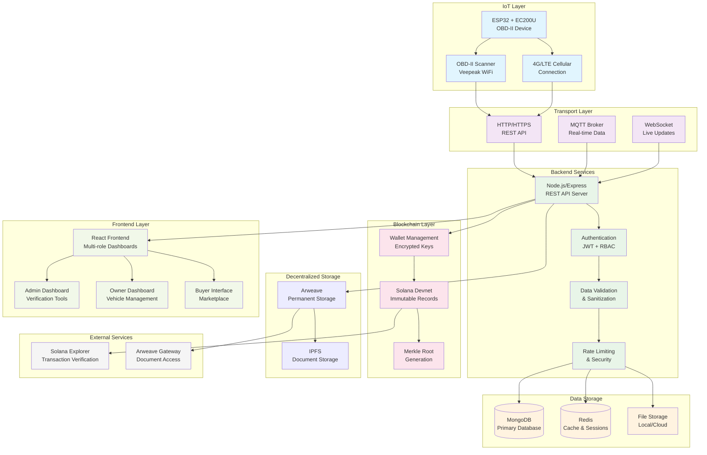

# BlockX - Comprehensive Repository Analysis

## Executive Summary

BlockX is a revolutionary blockchain-powered anti-fraud vehicle marketplace that prevents odometer fraud through immutable blockchain records, IoT device integration, and decentralized storage. The system implements a comprehensive ecosystem with ESP32/EC200U devices collecting real-time OBD-II data, a Node.js/Express backend with MongoDB storage, Solana blockchain integration for immutable records, Arweave for decentralized document storage, and a React frontend with multi-role dashboards.

---

## 1. Features Inventory

### ✅ Implemented Features

#### **Authentication & User Management**
- **Multi-role system**: 6 user roles (admin, owner, buyer, service, insurance, government)
- **JWT-based authentication** with refresh tokens
- **Role-based access control** with granular permissions
- **User profile management** with role-specific data
- **Account security**: 2FA, login attempts tracking, lockout protection
- **Files**: `backend/src/controllers/auth/`, `backend/src/models/core/User.model.ts`, `backend/src/middleware/auth.middleware.ts`

#### **Vehicle Management System**
- **Vehicle registration** with admin verification workflow
- **Odometer fraud detection** using blockchain and IoT validation
- **Vehicle history tracking** with immutable records
- **Trust score calculation** based on data integrity
- **Fraud alert system** with automated detection
- **Files**: `backend/src/controllers/vehicle/`, `backend/src/models/core/Vehicle.model.ts`, `frontend/src/components/vehicle/`

#### **IoT Device Integration**
- **ESP32 + EC200U cellular connectivity** for real-time data collection
- **OBD-II data collection** from multiple vehicle types (Hyundai i20, Maruti Brezza)
- **Anti-tampering validation** with cross-PID verification
- **Multiple data sources**: Veepeak OBD, Hyundai UDS, manual input
- **Offline data storage** with later synchronization
- **Files**: `esp32Code/ESP32_EC200U_Backend_TCP/`, `backend/src/controllers/device/`, `backend/src/models/core/Device.model.ts`

#### **Blockchain Integration**
- **Solana devnet integration** for immutable vehicle records
- **Wallet management** with encrypted private key storage
- **Transaction recording** for vehicle registration and mileage updates
- **Merkle root generation** for data integrity verification
- **Files**: `backend/src/services/blockchain/solana.service.ts`, `backend/src/controllers/blockchain/`

#### **Decentralized Storage**
- **Arweave integration** for permanent document storage
- **Vehicle document upload** with metadata tagging
- **Mileage history archival** for long-term storage
- **Cost estimation** and transaction tracking
- **Files**: `backend/src/services/blockchain/arweave.service.ts`, `frontend/src/components/arweave/`

#### **Admin Dashboard**
- **User management** with role-based filtering
- **Vehicle verification** workflow with approval/rejection
- **System monitoring** with health checks and metrics
- **Fraud investigation** tools with audit trails
- **Files**: `backend/src/controllers/admin/`, `frontend/src/components/admin/`, `frontend/src/components/dashboard/`

#### **Frontend Application**
- **React + TypeScript** with modern UI components
- **Multi-role dashboards** (Owner, Admin, Buyer, etc.)
- **Real-time notifications** with WebSocket integration
- **Responsive design** with Tailwind CSS
- **Theme support** with dark/light mode toggle
- **Files**: `frontend/src/components/`, `frontend/src/pages/`, `frontend/src/services/`

#### **Security & Monitoring**
- **Rate limiting** with configurable thresholds
- **Input validation** and sanitization
- **CORS protection** with environment-specific origins
- **Audit logging** with Winston
- **Health monitoring** with comprehensive status checks
- **Files**: `backend/src/middleware/`, `backend/src/utils/logger.ts`

---

## 2. Data Flow Diagram



---

## 3. API & MQTT Contracts

### **REST API Endpoints**

#### **Authentication Endpoints**
```
POST /api/auth/register
POST /api/auth/login
POST /api/auth/logout
POST /api/auth/refresh
GET  /api/auth/profile
PUT  /api/auth/profile
```

#### **Vehicle Management**
```
GET    /api/vehicles                    # List user's vehicles
POST   /api/vehicles/register          # Register new vehicle (pending)
GET    /api/vehicles/:id               # Get vehicle details
PUT    /api/vehicles/:id               # Update vehicle
DELETE /api/vehicles/:id               # Delete vehicle
POST   /api/vehicles/:id/mileage       # Update mileage
```

#### **Admin Endpoints**
```
GET    /api/admin/vehicles/pending     # Get pending vehicles
POST   /api/admin/vehicles/:id/approve # Approve vehicle
POST   /api/admin/vehicles/:id/reject  # Reject vehicle
GET    /api/admin/users                 # List all users
GET    /api/admin/dashboard            # Admin dashboard data
```

#### **Blockchain Endpoints**
```
POST   /api/blockchain/wallet/create   # Create user wallet
GET    /api/blockchain/wallet          # Get wallet info
POST   /api/blockchain/vehicle/register # Register on blockchain
POST   /api/blockchain/mileage/record  # Record mileage on blockchain
GET    /api/blockchain/transactions    # Get transaction history
GET    /api/blockchain/status          # Blockchain status
```

#### **Arweave Storage**
```
POST   /api/blockchain/arweave/upload  # Upload document
GET    /api/blockchain/arweave/status  # Arweave status
POST   /api/blockchain/arweave/estimate-cost # Cost estimation
```

#### **Device Integration**
```
POST   /api/device/status              # ESP32 device status
POST   /api/device/simple-status       # Simple status (no DB)
GET    /api/device/:deviceId           # Get device info
```

### **Request/Response Schemas**

#### **Vehicle Registration Request**
```json
{
  "vin": "1HGCM82633A123456",
  "vehicleNumber": "KA01AB1234",
  "make": "Honda",
  "model": "Civic",
  "year": 2023,
  "initialMileage": 50000,
  "color": "Blue",
  "bodyType": "sedan",
  "fuelType": "gasoline",
  "transmission": "automatic",
  "condition": "good"
}
```

#### **ESP32 Device Status**
```json
{
  "deviceID": "ESP32_BLOCKX_001",
  "status": "obd_connected",
  "vin": "BLOCKX123456789",
  "mileage": 50125,
  "rpm": 2200,
  "speed": 65,
  "engineTemp": 92,
  "fuelLevel": 75,
  "batteryVoltage": 13.2,
  "dataQuality": 95,
  "dataSource": "veepeak_obd"
}
```

#### **Blockchain Transaction**
```json
{
  "vehicleId": "vehicle-123",
  "vin": "BLOCKX123456789",
  "mileage": 50000,
  "timestamp": 1697875200000,
  "action": "REGISTER_VEHICLE",
  "transactionHash": "5ekCVGsXeD3E...",
  "blockNumber": 12345678
}
```

### **Authentication Headers**
```
Authorization: Bearer <JWT_TOKEN>
Content-Type: application/json
X-Requested-With: XMLHttpRequest
```

---

## 4. Database Schema Summary

### **MongoDB Collections**

#### **Users Collection**
```typescript
{
  _id: ObjectId,
  email: string (unique),
  password: string (hashed),
  firstName: string,
  lastName: string,
  role: 'admin' | 'owner' | 'buyer' | 'service' | 'insurance' | 'government',
  accountStatus: 'active' | 'pending' | 'suspended',
  blockchainWallet: {
    walletAddress: string,
    encryptedPrivateKey: string,
    blockchain: 'solana',
    network: 'devnet'
  },
  roleData: Object, // Role-specific data
  createdAt: Date,
  updatedAt: Date
}
```

#### **Vehicles Collection**
```typescript
{
  _id: ObjectId,
  vin: string (unique),
  vehicleNumber: string,
  ownerId: ObjectId,
  make: string,
  model: string,
  year: number,
  currentMileage: number,
  verificationStatus: 'pending' | 'verified' | 'flagged' | 'rejected',
  blockchainHash: string,
  blockchainAddress: string,
  trustScore: number,
  mileageHistory: [MileageRecord],
  fraudAlerts: [FraudAlert],
  createdAt: Date,
  updatedAt: Date
}
```

#### **Transactions Collection**
```typescript
{
  _id: ObjectId,
  transactionHash: string (unique),
  userId: ObjectId,
  vehicleId: ObjectId,
  type: 'vehicle_registration' | 'mileage_update' | 'document_upload',
  status: 'pending' | 'confirmed' | 'failed',
  blockchain: 'solana' | 'arweave',
  network: 'devnet' | 'mainnet',
  blockNumber: number,
  data: Object,
  createdAt: Date
}
```

#### **Device Telemetry Collection**
```typescript
{
  _id: ObjectId,
  deviceID: string,
  vehicleId: ObjectId,
  status: 'obd_connected' | 'device_not_connected' | 'error',
  vin: string,
  obd: {
    mileage: number,
    rpm: number,
    speed: number,
    engineTemp: number,
    fuelLevel: number
  },
  validation: {
    tamperingDetected: boolean,
    validationStatus: string,
    crossValidationResults: Array
  },
  timestamp: Date
}
```

### **OrbitDB/IPFS Usage**
- **Document storage**: Vehicle documents, service records
- **Mileage history**: Immutable historical data
- **Fraud evidence**: Tampering detection results
- **Metadata**: Searchable document tags and categories

---

## 5. Blockchain Interactions

### **Solana Integration**
- **Network**: Solana Devnet (`https://api.devnet.solana.com`)
- **Program**: Memo Program (`MemoSq4gqABAXKb96qnH8TysNcWxMyWCqXgDLGmfcHr`)
- **Transaction Types**: Vehicle registration, mileage updates
- **Wallet Management**: Encrypted private key storage

### **Merkle Root Generation**
```typescript
// Vehicle registration data structure
const vehicleData = {
  vehicleId: string,
  vin: string,
  mileage: number,
  timestamp: number,
  action: 'REGISTER_VEHICLE'
};

// Merkle root calculated from:
// 1. Vehicle metadata hash
// 2. Mileage history hash
// 3. Document hashes
// 4. Timestamp hash
```

### **Arweave Storage**
- **Network**: Arweave Testnet (`testnet.redstone.tools`)
- **Wallet**: `TCbup9b5dWIZaAT4ckm8xwOitBui51XtW2VelwyrUlM`
- **Document Types**: Vehicle documents, mileage history, fraud evidence
- **Tags**: Vehicle ID, document type, upload timestamp

### **Transaction Flow**
1. **Data Collection**: ESP32 → Backend API
2. **Validation**: Backend validates and sanitizes data
3. **Merkle Root**: Generate from vehicle data + history
4. **Blockchain Record**: Create Solana transaction with memo
5. **Document Storage**: Upload to Arweave with metadata
6. **Verification**: Update database with transaction hashes

---

## 6. Gaps & Risks

### **Security Risks**
- **API Rate Limiting**: Current limits may be insufficient for production
- **Wallet Security**: Private keys stored encrypted but need hardware security modules
- **IoT Device Security**: ESP32 devices vulnerable to physical tampering
- **Data Validation**: Limited input validation on device data

### **Reliability Issues**
- **Network Connectivity**: ESP32 cellular connection may be unreliable
- **Blockchain Dependencies**: Solana network outages affect functionality
- **Database Consistency**: No distributed transaction handling
- **Offline Handling**: Limited offline data storage and sync

### **Cost Concerns**
- **Blockchain Fees**: Solana transaction costs for high-volume usage
- **Arweave Storage**: Permanent storage costs for large documents
- **Cellular Data**: ESP32 cellular usage costs
- **Infrastructure**: MongoDB, Redis, and hosting costs

### **Technical Gaps**
- **MQTT Broker**: No MQTT broker implementation found
- **Real-time Updates**: Limited WebSocket implementation
- **Monitoring**: No comprehensive system monitoring
- **Backup Strategy**: No disaster recovery plan

---

## 7. Prioritized Next Actions

### **Short Term (1-2 weeks)**
1. **Implement MQTT Broker** (`backend/src/services/mqtt/`)
   - Add MQTT service for real-time device communication
   - Configure topic structure for device data
   - Add message queuing for offline devices

2. **Enhance Security** (`backend/src/middleware/security.middleware.ts`)
   - Implement hardware security module for wallet keys
   - Add device authentication for ESP32
   - Enhance rate limiting with IP-based throttling

3. **Add System Monitoring** (`backend/src/services/monitoring/`)
   - Implement health checks for all services
   - Add metrics collection and alerting
   - Create dashboard for system status

### **Medium Term (1-2 months)**
1. **Implement Offline Sync** (`backend/src/services/sync/`)
   - Add offline data storage for ESP32
   - Implement conflict resolution for data sync
   - Add batch processing for offline data

2. **Add Real-time Features** (`frontend/src/services/websocket.ts`)
   - Implement WebSocket for live updates
   - Add real-time notifications
   - Create live dashboard updates

3. **Enhance Blockchain Integration** (`backend/src/services/blockchain/`)
   - Add Merkle tree implementation
   - Implement batch transactions
   - Add transaction verification

### **Long Term (3-6 months)**
1. **Scale Infrastructure** (`backend/src/services/scaling/`)
   - Implement database sharding
   - Add load balancing
   - Create microservices architecture

2. **Add Advanced Analytics** (`backend/src/services/analytics/`)
   - Implement fraud detection algorithms
   - Add predictive analytics
   - Create reporting dashboard

3. **Implement Compliance** (`backend/src/services/compliance/`)
   - Add GDPR compliance features
   - Implement data retention policies
   - Add audit logging

---

## 8. Hackathon Deliverables

### **MVP Checklist**
- [x] User authentication and role management
- [x] Vehicle registration with admin verification
- [x] ESP32 device integration
- [x] Solana blockchain integration
- [x] Arweave document storage
- [x] React frontend with dashboards
- [x] Basic fraud detection
- [ ] Real-time notifications
- [ ] Mobile responsiveness
- [ ] Performance optimization

### **Demo Script (2 minutes)**
1. **Introduction (15s)**: "BlockX prevents odometer fraud using blockchain and IoT"
2. **Device Demo (30s)**: Show ESP32 collecting OBD data and sending to backend
3. **Registration Flow (30s)**: Register vehicle, show admin approval, blockchain record
4. **Fraud Detection (30s)**: Show tampering detection and trust score calculation
5. **Document Storage (15s)**: Upload document to Arweave, show permanent storage

### **2-Minute Video Storyboard**
```
0:00-0:15  - Title screen: "BlockX - Anti-Fraud Vehicle Marketplace"
0:15-0:30  - Problem: Odometer fraud costs billions annually
0:30-0:45  - Solution: ESP32 + Blockchain + Arweave
0:45-1:00  - Device demo: ESP32 collecting real OBD data
1:00-1:15  - Backend: Data validation and fraud detection
1:15-1:30  - Blockchain: Immutable records on Solana
1:30-1:45  - Storage: Documents on Arweave
1:45-2:00  - Frontend: Multi-role dashboards and verification
```

---

## 9. Concrete Commit-Level Tasks

### **Task 1: Implement MQTT Broker Integration**
**Files**: `backend/src/services/mqtt/mqtt.service.ts`, `backend/src/routes/device/device.routes.ts`
**Commit**: `feat: add MQTT broker for real-time device communication`
**Complexity**: Medium
**Description**: Implement MQTT service for ESP32 device communication with topic-based routing

### **Task 2: Add Hardware Security Module for Wallets**
**Files**: `backend/src/services/security/hsm.service.ts`, `backend/src/services/blockchain/wallet.service.ts`
**Commit**: `security: implement HSM for wallet private key protection`
**Complexity**: High
**Description**: Add hardware security module integration for encrypted wallet key storage

### **Task 3: Implement Real-time WebSocket Notifications**
**Files**: `frontend/src/services/websocket.ts`, `backend/src/services/websocket/websocket.service.ts`
**Commit**: `feat: add real-time notifications via WebSocket`
**Complexity**: Medium
**Description**: Implement WebSocket service for live updates and notifications

### **Task 4: Add Comprehensive System Monitoring**
**Files**: `backend/src/services/monitoring/health.service.ts`, `frontend/src/components/admin/SystemMonitor.tsx`
**Commit**: `feat: implement comprehensive system monitoring and health checks`
**Complexity**: Medium
**Description**: Add monitoring service with health checks, metrics, and alerting

### **Task 5: Implement Offline Data Sync for ESP32**
**Files**: `esp32Code/ESP32_EC200U_Backend_TCP/ESP32_EC200U_Backend_TCP.ino`, `backend/src/services/sync/offline-sync.service.ts`
**Commit**: `feat: add offline data storage and sync for ESP32 devices`
**Complexity**: High
**Description**: Implement offline data storage on ESP32 with conflict resolution and batch sync

---

## Missing Environment Variables

The following environment variables are referenced but not found in the repository:
- `MONGODB_URI` - MongoDB connection string
- `JWT_SECRET` - JWT signing secret
- `JWT_REFRESH_SECRET` - JWT refresh token secret
- `REDIS_URL` - Redis connection string
- `SOLANA_RPC_URL` - Solana RPC endpoint
- `ARWEAVE_WALLET_KEY` - Arweave wallet private key
- `CORS_ORIGIN` - CORS allowed origins
- `FRONTEND_URL` - Frontend application URL
- `RATE_LIMIT_WINDOW_MS` - Rate limiting window
- `RATE_LIMIT_MAX_REQUESTS` - Maximum requests per window

---

## Conclusion

BlockX represents a comprehensive anti-fraud vehicle marketplace with robust blockchain integration, IoT device connectivity, and decentralized storage. The system successfully implements the core features for preventing odometer fraud through immutable records and real-time validation. The architecture is well-designed with clear separation of concerns, but requires additional security measures, monitoring, and offline capabilities for production deployment.

The hackathon deliverables are well-positioned for demonstration, with a clear MVP checklist and demo script. The prioritized next actions provide a roadmap for enhancing the system's reliability, security, and scalability for production use.
