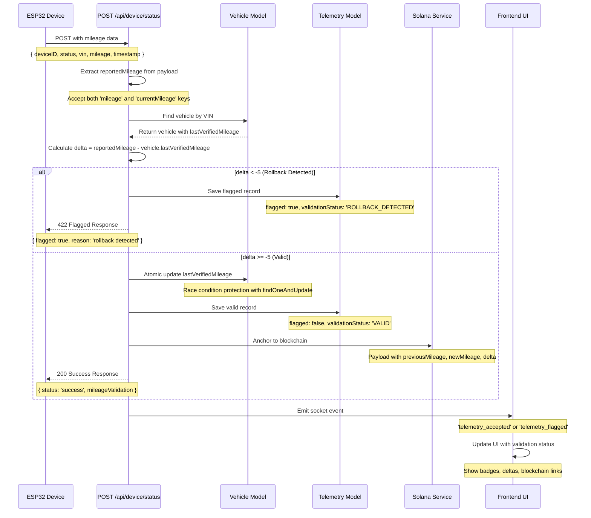

# Mileage Validation Flow - Sequence Diagram

## Key Validation Rules

1. **Rollback Detection**: Any decrease > 5km is flagged as fraud
2. **Atomic Updates**: Race condition protection with findOneAndUpdate
3. **Authoritative Source**: Always use vehicle.lastVerifiedMileage, never trust device
4. **Backwards Compatibility**: Accept both 'mileage' and 'currentMileage' keys
5. **Blockchain Anchoring**: Only valid records are anchored, flagged records are not

## Error Handling

- **422 Flagged**: Rollback detected, record saved but not anchored
- **500 Error**: System error, record not saved
- **400 Bad Request**: Missing required fields

## Frontend Integration

- **Valid Records**: Green badge, positive delta, blockchain link
- **Flagged Records**: Red badge, negative delta, "Not anchored" status
- **Suspicious Records**: Yellow badge, large delta, review required

