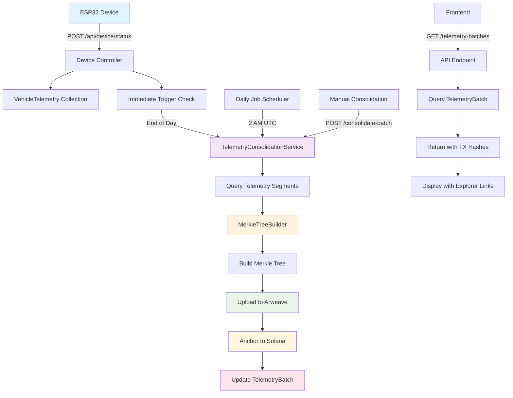

# Telemetry Batch Anchoring Data Flow

## Key Components:

1. **ESP32 Device**: Sends telemetry data via HTTP POST
2. **Device Controller**: Processes data and triggers immediate consolidation
3. **TelemetryConsolidationService**: Main service for batch processing
4. **MerkleTreeBuilder**: Creates deterministic Merkle trees
5. **Arweave Service**: Uploads data for permanent storage
6. **Solana Service**: Anchors Merkle root to blockchain
7. **Daily Job**: Nightly consolidation for all vehicles
8. **Frontend**: Displays batches with transaction links
