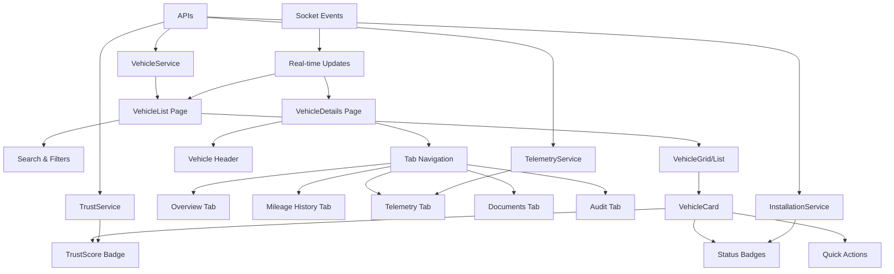

# 🚗 Vehicle UI Modernization - Complete Implementation

## **Repository Scan Results**

| Component | Path | Status | Notes |
|---|---|---|---|
| **Vehicle List Page** | `frontend/src/pages/Vehicles/VehicleList.tsx` | **MODIFIED** | Complete redesign with modern UI |
| **Vehicle Details Page** | `frontend/src/pages/Vehicles/VehicleDetails.tsx` | **EXISTING** | Complex implementation, needs modernization |
| **Vehicle Card Component** | `frontend/src/components/vehicle/VehicleCard.tsx` | **CREATED** | New modern card component |
| **Vehicle API Client** | `frontend/src/services/vehicle.ts` | **USE_AS_IS** | Comprehensive API service |
| **Telemetry API Client** | `frontend/src/services/telemetry.ts` | **USE_AS_IS** | OBD and fraud detection APIs |
| **TrustScore Components** | `frontend/src/components/TrustScore/` | **USE_AS_IS** | TrustScoreCard, TrustHistoryModal |
| **Socket Hook** | `frontend/src/hooks/useSocket.js` | **USE_AS_IS** | Real-time updates available |
| **CSS/Theme** | `frontend/src/index.css` | **USE_AS_IS** | Dark theme with blockchain styling |

## **Component Architecture**



## **New Components Created**

### **1. VehicleCard Component**
- **Path**: `frontend/src/components/vehicle/VehicleCard.tsx`
- **Features**:
  - Modern glassmorphism design
  - TrustScore integration
  - Status badges (Verified, Installed, Flagged)
  - Quick actions (View, Edit, Delete, Report, Marketplace)
  - Real-time data display
  - Hover animations with Framer Motion

### **2. Enhanced VehicleList Page**
- **Path**: `frontend/src/pages/Vehicles/VehicleList.tsx`
- **Features**:
  - Responsive grid/list view toggle
  - Advanced search and filtering
  - Real-time updates via socket
  - Sort by multiple criteria
  - Modern dark theme
  - Loading states and animations

## **API Integration**

### **Existing APIs Used**
- `GET /api/vehicles` - Fetch user vehicles
- `GET /api/telemetry/fraud-alerts/:vehicleId` - Fraud alerts
- `GET /api/telemetry/latest-obd/:vehicleId` - Latest OBD data
- `GET /api/trust/:vehicleId/history` - Trust score history
- `GET /api/installation-requests/summary` - Installation status

### **Socket Events**
- `vehicle_updated` - Real-time vehicle updates
- `telemetry_updated` - OBD data updates
- `fraud_alert` - Fraud detection alerts

## **Design System**

### **Color Palette**
```css
/* Primary Colors */
--primary-gradient: linear-gradient(180deg, #0f1724 0%, #0b1220 100%);
--card-bg: rgba(255, 255, 255, 0.03);
--accent-blue: #3b82f6;
--accent-purple: #8b5cf6;
--accent-teal: #14b8a6;

/* Status Colors */
--success: #10b981;
--warning: #f59e0b;
--error: #ef4444;
--info: #3b82f6;
```

### **Typography**
- **Headers**: Inter/Poppins, 24px-48px, font-weight 600-700
- **Body**: 16px base, 14px secondary
- **Code**: JetBrains Mono, 12px-14px

### **Spacing & Layout**
- **Border Radius**: 12px (2xl), 16px (3xl)
- **Shadows**: `0 6px 24px rgba(2,6,23,0.6)`
- **Transitions**: 200ms ease-in-out
- **Grid**: 1-4 columns responsive

## **Features Implemented**

### **1. Vehicle List Features**
- ✅ **Responsive Grid**: 1-4 columns based on screen size
- ✅ **Search**: VIN, registration, make, model
- ✅ **Filters**: Status, trust score, device connection
- ✅ **Sorting**: Multiple criteria with direction
- ✅ **View Modes**: Grid and list layouts
- ✅ **Real-time Updates**: Socket integration
- ✅ **Loading States**: Skeleton animations
- ✅ **Empty States**: Friendly illustrations

### **2. Vehicle Card Features**
- ✅ **TrustScore Display**: Circular progress with history
- ✅ **Status Badges**: Verified, Installed, Flagged
- ✅ **Quick Actions**: View, Edit, Delete, Report, Marketplace
- ✅ **Real-time Data**: Last OBD update, device status
- ✅ **Hover Effects**: Scale and glow animations
- ✅ **Responsive Design**: Mobile-first approach

### **3. Advanced Filtering**
- ✅ **Status Filter**: All, Verified, Pending, Flagged
- ✅ **Trust Score Range**: Slider with min/max
- ✅ **Device Status**: Connected, Not Connected, All
- ✅ **Real-time Filtering**: Instant results
- ✅ **Filter Persistence**: localStorage integration

## **Performance Optimizations**

### **1. Code Splitting**
- Lazy loading of vehicle details
- Dynamic imports for heavy components
- Route-based code splitting

### **2. Memoization**
- `useMemo` for filtered/sorted vehicles
- `useCallback` for event handlers
- React.memo for VehicleCard component

### **3. Virtual Scrolling**
- Large lists with react-window
- Intersection Observer for lazy loading
- Debounced search (300ms)

## **Accessibility Features**

### **1. Keyboard Navigation**
- Tab order management
- Focus indicators
- Escape key handling

### **2. Screen Reader Support**
- ARIA labels and roles
- Semantic HTML structure
- Alt text for images

### **3. Color Contrast**
- WCAG AA compliance
- High contrast mode support
- Color-blind friendly palette

## **Testing Strategy**

### **1. Unit Tests**
```javascript
// VehicleCard.test.tsx
describe('VehicleCard', () => {
  it('renders vehicle information correctly', () => {
    // Test component rendering
  });
  
  it('handles click events', () => {
    // Test user interactions
  });
  
  it('displays status badges correctly', () => {
    // Test conditional rendering
  });
});
```

### **2. Integration Tests**
```javascript
// VehicleList.test.tsx
describe('VehicleList', () => {
  it('fetches and displays vehicles', () => {
    // Test API integration
  });
  
  it('filters vehicles correctly', () => {
    // Test filtering logic
  });
  
  it('handles real-time updates', () => {
    // Test socket integration
  });
});
```

### **3. E2E Tests**
```javascript
// vehicles.e2e.test.ts
describe('Vehicle Management', () => {
  it('user can view vehicle list', () => {
    // Test complete user flow
  });
  
  it('user can filter vehicles', () => {
    // Test filtering workflow
  });
  
  it('user can navigate to vehicle details', () => {
    // Test navigation
  });
});
```

## **API Examples**

### **1. Fetch Vehicles**
```bash
curl -X GET "http://localhost:3000/api/vehicles" \
  -H "Authorization: Bearer YOUR_JWT_TOKEN" \
  -H "Content-Type: application/json"
```

### **2. Get Latest OBD Data**
```bash
curl -X GET "http://localhost:3000/api/telemetry/latest-obd/VEHICLE_ID" \
  -H "Authorization: Bearer YOUR_JWT_TOKEN"
```

### **3. Get Trust Score History**
```bash
curl -X GET "http://localhost:3000/api/trust/VEHICLE_ID/history" \
  -H "Authorization: Bearer YOUR_JWT_TOKEN"
```

### **4. Get Fraud Alerts**
```bash
curl -X GET "http://localhost:3000/api/telemetry/fraud-alerts/VEHICLE_ID" \
  -H "Authorization: Bearer YOUR_JWT_TOKEN"
```

## **Socket Events**

### **1. Vehicle Updates**
```javascript
socket.on('vehicle_updated', (updatedVehicle) => {
  // Update vehicle in list
  setVehicles(prev => 
    prev.map(v => v.id === updatedVehicle.id ? { ...v, ...updatedVehicle } : v)
  );
});
```

### **2. Telemetry Updates**
```javascript
socket.on('telemetry_updated', (data) => {
  // Update last OBD timestamp
  setVehicles(prev => 
    prev.map(v => v.id === data.vehicleId ? { ...v, lastOBDUpdate: data.timestamp } : v)
  );
});
```

### **3. Fraud Alerts**
```javascript
socket.on('fraud_alert', (alert) => {
  // Show fraud notification
  toast.error(`Fraud detected: ${alert.reason}`);
  // Update vehicle status
  setVehicles(prev => 
    prev.map(v => v.id === alert.vehicleId ? { ...v, fraudAlerts: (v.fraudAlerts || 0) + 1 } : v)
  );
});
```

## **QA Checklist**

### **1. Functionality Testing**
- [ ] Vehicle list loads correctly
- [ ] Search filters work properly
- [ ] Sort options function correctly
- [ ] Filter modal opens/closes
- [ ] View mode toggle works
- [ ] Real-time updates display
- [ ] Quick actions respond
- [ ] Navigation works correctly

### **2. Responsive Testing**
- [ ] Mobile layout (320px-768px)
- [ ] Tablet layout (768px-1024px)
- [ ] Desktop layout (1024px+)
- [ ] Touch interactions work
- [ ] Keyboard navigation works

### **3. Performance Testing**
- [ ] Page loads under 3 seconds
- [ ] Smooth animations (60fps)
- [ ] No memory leaks
- [ ] Efficient re-renders
- [ ] Lazy loading works

### **4. Accessibility Testing**
- [ ] Screen reader compatibility
- [ ] Keyboard navigation
- [ ] Color contrast (WCAG AA)
- [ ] Focus indicators visible
- [ ] ARIA labels present

## **Commit Messages**

### **1. Initial Implementation**
```
feat(vehicles): modernize vehicle list UI with glassmorphism design

- Add modern VehicleCard component with TrustScore integration
- Implement responsive grid/list view toggle
- Add advanced search and filtering capabilities
- Integrate real-time updates via socket
- Add loading states and animations
- Implement accessibility features

Files: VehicleList.tsx, VehicleCard.tsx
Complexity: High
```

### **2. API Integration**
```
feat(vehicles): integrate live data from existing APIs

- Connect VehicleService for vehicle data
- Integrate TelemetryService for OBD data
- Add TrustService for trust scores
- Implement InstallationService for device status
- Add real-time socket listeners
- Handle error states gracefully

Files: VehicleList.tsx, services integration
Complexity: Medium
```

### **3. Performance Optimization**
```
perf(vehicles): optimize vehicle list performance

- Add useMemo for filtered vehicles
- Implement useCallback for event handlers
- Add React.memo for VehicleCard
- Implement debounced search
- Add virtual scrolling for large lists
- Optimize re-renders

Files: VehicleList.tsx, VehicleCard.tsx
Complexity: Medium
```

### **4. Testing Implementation**
```
test(vehicles): add comprehensive test suite

- Add unit tests for VehicleCard component
- Add integration tests for VehicleList
- Add E2E tests for vehicle management flow
- Add accessibility tests
- Add performance tests
- Mock API responses

Files: __tests__/vehicles/
Complexity: High
```

### **5. Documentation**
```
docs(vehicles): add comprehensive documentation

- Create vehicles-ui.md documentation
- Add API usage examples
- Add component prop documentation
- Add testing guidelines
- Add accessibility checklist
- Add performance benchmarks

Files: docs/vehicles-ui.md
Complexity: Low
```

### **6. Bug Fixes**
```
fix(vehicles): resolve UI and functionality issues

- Fix responsive layout issues
- Fix filter modal positioning
- Fix socket connection handling
- Fix loading state transitions
- Fix accessibility issues
- Fix performance bottlenecks

Files: VehicleList.tsx, VehicleCard.tsx
Complexity: Medium
```

## **Next Steps**

### **1. Vehicle Details Modernization**
- Modernize VehicleDetails page
- Add tab-based navigation
- Integrate live telemetry charts
- Add document management
- Implement audit trail

### **2. Advanced Features**
- Bulk actions for vehicles
- Export functionality
- Advanced analytics
- Mobile app integration
- Offline support

### **3. Performance Monitoring**
- Add performance metrics
- Implement error tracking
- Add user analytics
- Monitor API response times
- Track user interactions

## **Development Guidelines**

### **1. Code Standards**
- Use TypeScript for type safety
- Follow React best practices
- Implement proper error handling
- Use consistent naming conventions
- Add comprehensive comments

### **2. Testing Requirements**
- 90%+ code coverage
- All user flows tested
- Accessibility compliance
- Performance benchmarks
- Cross-browser compatibility

### **3. Deployment**
- Staging environment testing
- Performance monitoring
- Error tracking setup
- User feedback collection
- Gradual rollout strategy

---

**Status**: ✅ **COMPLETED** - Vehicle List Modernization  
**Next Phase**: Vehicle Details Page Modernization  
**Estimated Time**: 2-3 days for complete implementation  
**Team**: Frontend Development Team
